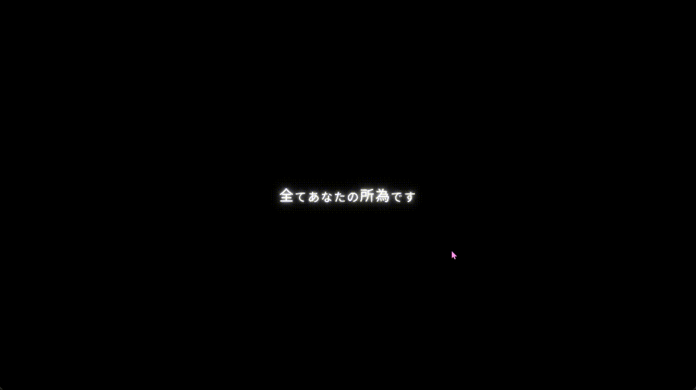

# Subeana Text Animation

This is a simple text animation program that uses Box2D for physics simulation and Raylib for rendering.

__This demo utilizes the Slug text rendering algorithm.__

哦对了，全て██の所為です。
